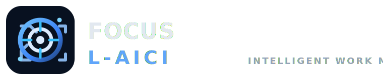
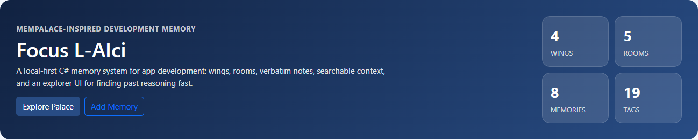
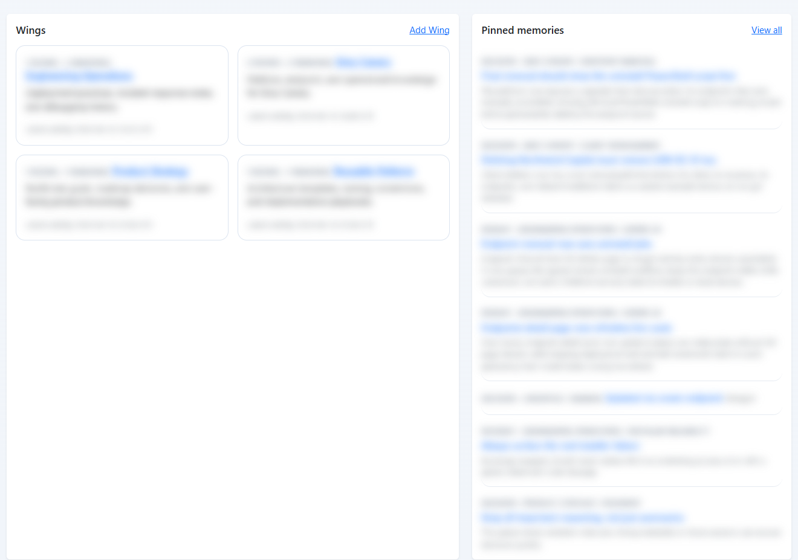
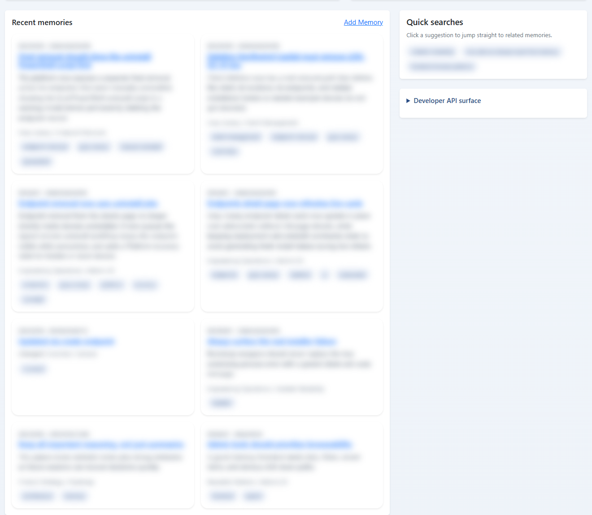
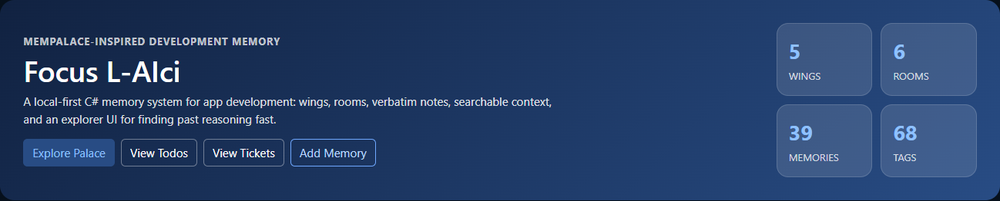
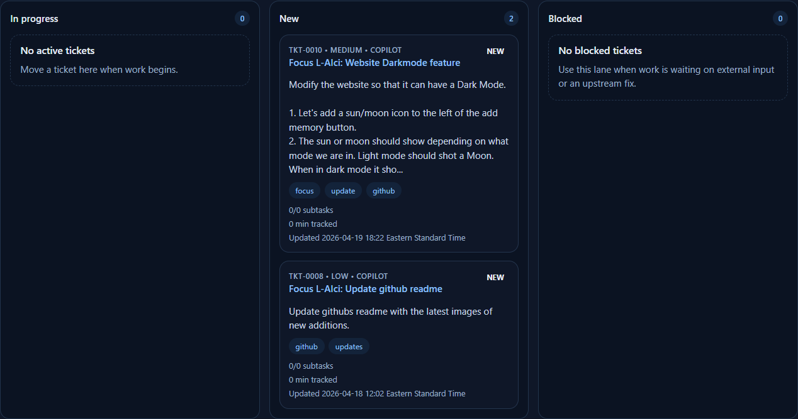
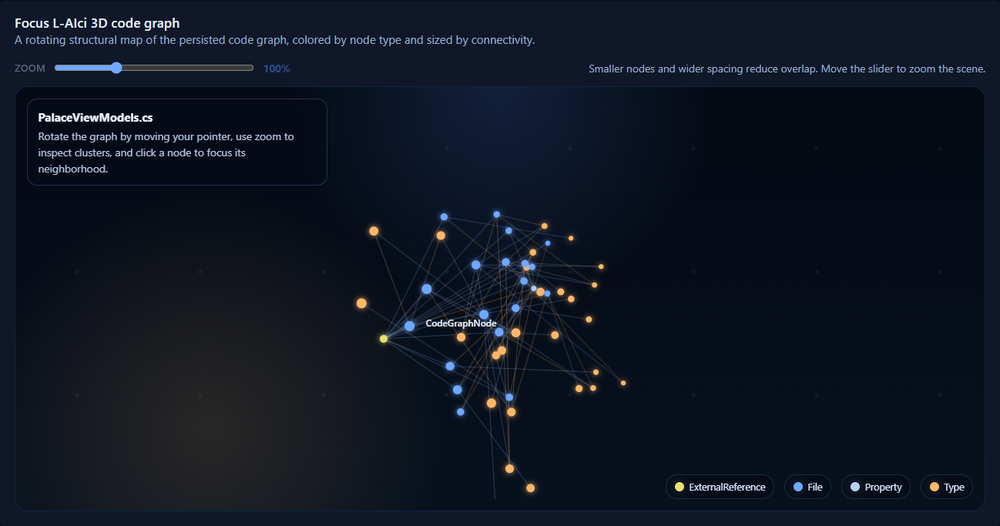

# Focus L-AIci



> Local-first engineering memory for decisions, incidents, tickets, code graphs, and AI-assisted work.

**Start here**

- **AI setup:** [docs/AI-AUTOSETUP-PROMPT.md](docs/AI-AUTOSETUP-PROMPT.md)
- **Feature guide:** [docs/FEATURES.md](docs/FEATURES.md)
- **Usage guide:** [docs/USING-FOCUS-L-AICI.md](docs/USING-FOCUS-L-AICI.md)

**Focus L-AIci** is a local-first memory palace for engineers, builders, researchers, and AI-assisted teams who do not want important reasoning to disappear into chat history.

It captures the *why* behind work, not just the *what*, by organizing knowledge into **wings**, **rooms**, **memories**, **tags**, and **relationships**. The result is a system you can search, browse, inspect, and reuse across future sessions without depending on a hosted service.

## Why people use it

Most teams lose critical context in the same places:

- temporary chats
- debugging sessions
- deployment notes
- architecture discussions
- scattered markdown files
- "we already solved this once" moments

Focus L-AIci turns that lost context into a searchable, browsable, persistent knowledge system you can run on your own machine.

## What it includes

- a structured memory palace built around wings, rooms, memories, tags, and links
- a dashboard context workspace for task-specific retrieval and export
- todo and ticket tracking for active implementation work
- a persistent code graph with repository browsing and symbol relationships
- a **3D palace graph** / visualizer for wings, rooms, memories, and active work
- inspect and governance surfaces for trust, freshness, and lifecycle review

For the full capability breakdown, recent additions, and API surface, see [docs/FEATURES.md](docs/FEATURES.md).

## Dashboard preview

These screenshots were captured from a live local Focus L-AIci instance. Memory content, wing names, and other user-authored details are intentionally blurred.







## Current UI preview

Recent additions shown below were captured from the current build in dark mode.







## Technology

- **ASP.NET Core MVC**
- **Entity Framework Core**
- **SQLite**
- **xUnit** test coverage for core service behavior

The project is intentionally simple to run, easy to extend, and practical for local use.

## Quick start

```powershell
dotnet restore
dotnet run --project .\FocusLAIci.Web\FocusLAIci.Web.csproj
```

By default, the app listens on:

```text
http://127.0.0.1:5187
```

To run the tests:

```powershell
dotnet test .\FocusLAIci.slnx
```

## Demo data

In development, Focus L-AIci can seed starter content automatically so you can explore the experience immediately. The included sample data demonstrates:

- product strategy memories
- engineering incident notes
- reusable implementation patterns
- linked knowledge across multiple domains

## Why this project stands out

Focus L-AIci is built for **high-value retained context**:

- why an architecture decision was made
- what broke in production
- how a difficult bug was fixed
- which implementation pattern worked before
- what an AI workflow should remember next time

That makes it especially useful for people building complex systems over time, where the biggest productivity loss is not lack of information, but lack of **recoverable reasoning**.

## License

This repository is licensed under the terms of the included [LICENSE](LICENSE).
