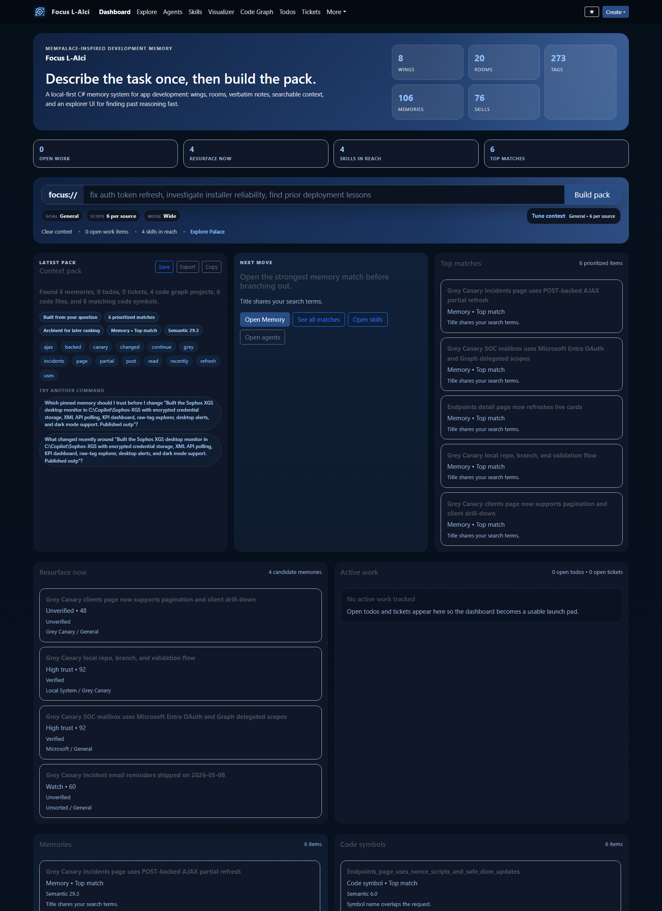
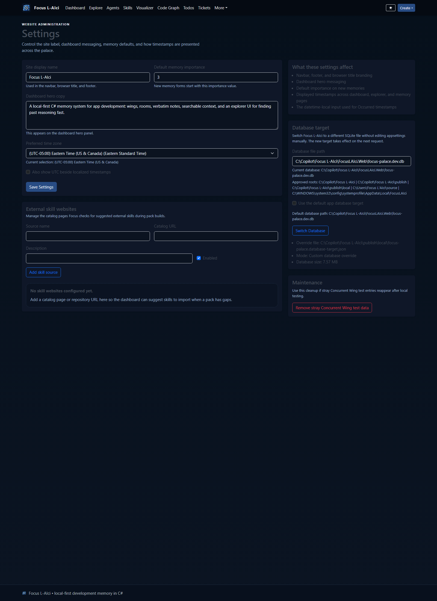

# Focus L-AIci


> Local-first engineering memory for decisions, incidents, tickets, code graphs, and AI-assisted work.

**Start here**

- **AI setup:** [docs/AI-AUTOSETUP-PROMPT.md](docs/AI-AUTOSETUP-PROMPT.md)
- **Feature guide:** [docs/FEATURES.md](docs/FEATURES.md)
- **Usage guide:** [docs/USING-FOCUS-L-AICI.md](docs/USING-FOCUS-L-AICI.md)
- **Tiny model guide:** [docs/TINY-LOCAL-PACK-INTENT-MODEL.md](docs/TINY-LOCAL-PACK-INTENT-MODEL.md)

**Focus L-AIci** is a local-first memory palace for engineers, builders, researchers, and AI-assisted teams who do not want important reasoning to disappear into chat history.

It captures the *why* behind work, not just the *what*, by organizing knowledge into **wings**, **rooms**, **memories**, **tags**, and **relationships**. The result is a system you can search, browse, inspect, and reuse across future sessions without depending on a hosted service.

## Why people use it

Most teams lose critical context in the same places:

- temporary chats
- debugging sessions
- deployment notes
- architecture discussions
- scattered markdown files
- "we already solved this once" moments

Focus L-AIci turns that lost context into a searchable, browsable, persistent knowledge system you can run on your own machine.

## What it includes

- a structured memory palace built around wings, rooms, memories, tags, and links
- a dashboard context workspace for task-specific retrieval, export, archival, and refinement
- seven built-in scoped agents for triage, context, research, impact, bounded execution, curation, and review, with filtered browse/detail pages, runnable task briefs, related context, companion skills, and MCP routing
- todo and ticket tracking for active implementation work
- a persistent code graph with repository browsing and symbol relationships
- a **3D palace graph** / visualizer for wings, rooms, memories, and active work
- inspect and governance surfaces for trust, freshness, and lifecycle review
- pack-build history in SQLite for later review and ranking
- external skill-source suggestions with Admin-managed website catalogs and import-from-web flow
- a local-first **MCP server surface** with tools, resources, sessions, and live event streaming
- safer MCP memory automation with duplicate detection, merge/canonical flows, filtered context retrieval, bootstrap profiles, governance queues, and scoped API-key access

For the full capability breakdown, recent additions, and API surface, see [docs/FEATURES.md](docs/FEATURES.md).

## Current app preview

These screenshots were captured from the current hosted Focus L-AIci build.





## What changed recently

- **Pack refinement loop** - every built context pack can now be archived into SQLite with counts, export text, and review fields so later ranking/tuning work has durable raw material.
- **Decision-aware context packs** - context packs now record the routing/retrieval decision that produced them, including explicit causes, evidence, and nearby memory fallbacks when Focus needs clarification or lacks grounded support.
- **External skill sourcing** - Focus can check configured external skill websites, suggest matching skills when a pack has gaps, and import a selected skill back into the local catalog.
- **Admin-managed skill websites** - the source website list now lives on **Admin -> Settings** instead of being hard-coded.


## Technology

- **ASP.NET Core MVC**
- **Entity Framework Core**
- **SQLite**
- **xUnit** test coverage for core service behavior

The project is intentionally simple to run, easy to extend, and practical for local use.

## Quick start

```powershell
dotnet restore
dotnet run --project .\FocusLAIci.Web\FocusLAIci.Web.csproj
```

By default, the app listens on:

```text
http://127.0.0.1:5191
```

## MCP server quick start

Focus L-AIci now exposes a local-first MCP surface for AI clients and automation:

- `POST /api/mcp` - standard streamable HTTP MCP endpoint for initialize, tools, resources, and completions
- `GET /api/mcp` - optional SSE stream for resource update notifications after initialization
- `DELETE /api/mcp` - end an MCP session by `Mcp-Session-Id`
- `GET /api/mcp/manifest` - discover Focus-specific auth details and compatibility metadata
- `POST /api/mcp/message` - legacy local Focus MCP envelope maintained for the admin console
- `GET /api/mcp/events/{sessionId}` - legacy SSE endpoint for the local Focus envelope
- `/Admin/McpConsole` - operator console for testing requests and watching event flow

By default, loopback clients are allowed without an API key. Non-loopback clients remain blocked unless `FocusPalace:Mcp:ApiKeys` or `FocusPalace:Mcp:ApiKeysCsv` is configured.

## Best way to start a task now

If you want an operator or AI agent to use Focus well, the best pattern is:

1. **Check Focus first** - search memories, inspect recent changes, and build a context pack before making assumptions.
2. **Work from retrieved context** - use the dashboard, Inspect, Code Graph, tickets, and todos as the current source of project memory.
3. **Write back durable outcomes** - store decisions, fixes, patterns, and tracked work in Focus when the task is done.

For AI-assisted workflows, the most reliable instruction is:

```text
Start with Focus. Read relevant memories, build a context pack, check recent changes and tickets if relevant, then begin the task.
```

That instruction aligns with the strongest current Focus flow:

- `focus.memory.search` or dashboard/context retrieval first
- Inspect/workspace export for fast orientation
- tickets/todos for active tracked work
- MCP tools/resources when the client can keep a session open

To run the tests:

```powershell
dotnet test .\FocusLAIci.slnx
```

## Demo data

In development, Focus L-AIci can seed starter content automatically so you can explore the experience immediately. The included sample data demonstrates:

- product strategy memories
- engineering incident notes
- reusable implementation patterns
- linked knowledge across multiple domains

## Why this project stands out

Focus L-AIci is built for **high-value retained context**:

- why an architecture decision was made
- what broke in production
- how a difficult bug was fixed
- which implementation pattern worked before
- what an AI workflow should remember next time

That makes it especially useful for people building complex systems over time, where the biggest productivity loss is not lack of information, but lack of **recoverable reasoning**.

## License

This repository is licensed under the terms of the included [LICENSE](LICENSE).
